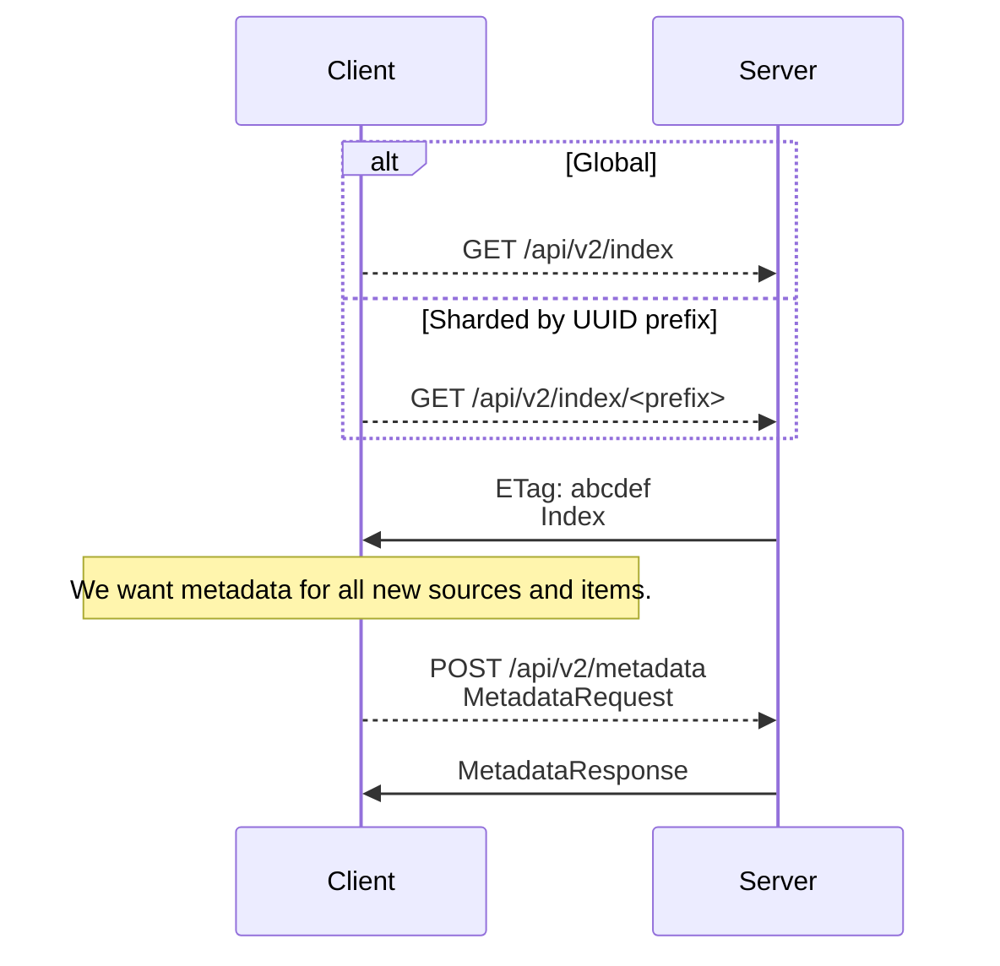
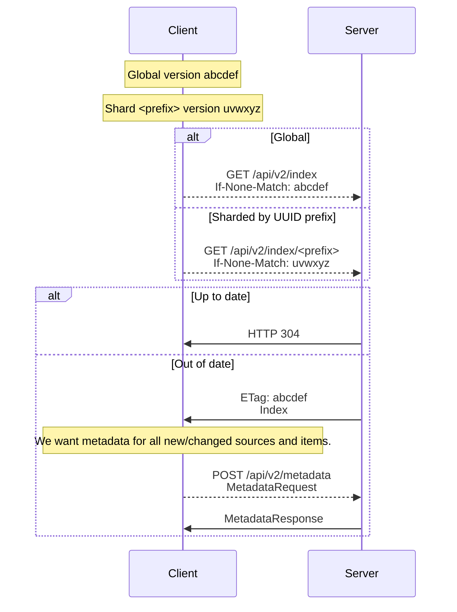
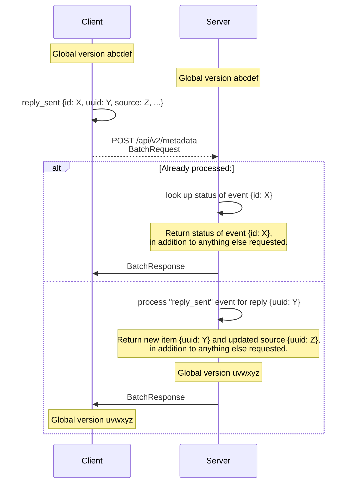
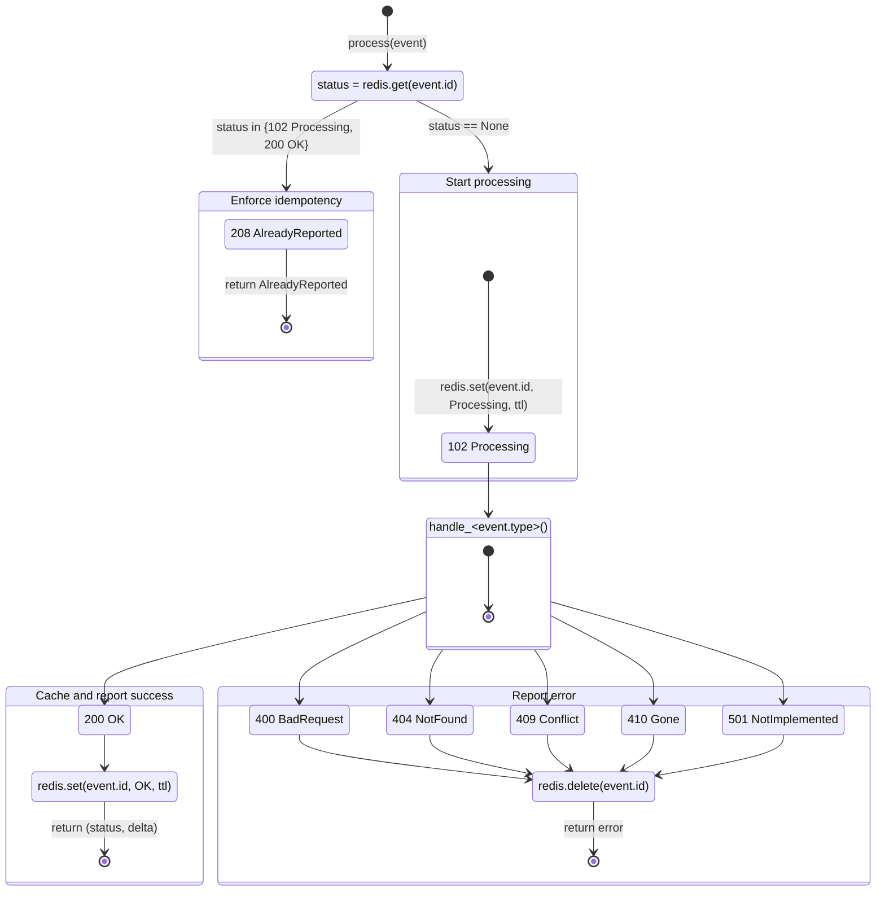

# Journalist API v2

The `securedrop.journalist_app.api2` package implements the synchronization
strategy for the v2 Journalist API.

| File/module                             | Contents                                                                                                       |
| --------------------------------------- | -------------------------------------------------------------------------------------------------------------- |
| `API2.md` (you are here)                | Specification                                                                                                  |
| `securedrop.journalist_app.api2`        | Flask blueprint for `/api/v2/`                                                                                 |
| `securedrop.journalist_app.api2.events` | Event-handling framework                                                                                       |
| `securedrop.journalist_app.api2.shared` | Helper functions factored out of and still shared with the v1 Journalist API (`securedrop.journalist_app.api`) |
| `securedrop.journalist_app.api2.types`  | Types                                                                                                          |
| `securedrop.tests.test_journalist_api2` | Test suite for server implementation                                                                           |

A client-side implementation should be able to interact with the endpoints
implemented in `securedrop.journalist_app.api2` according to this specification.

## Audience

This API is intended for use by the [SecureDrop journalist app][app], and this
documentation is intended to support its development. We make no guarantees
about support, compatibility, or documentation for other purposes.

[app]: https://github.com/freedomofpress/securedrop-client/tree/main/app

## Goals and properties

Although the SecureDrop Server remains the source of truth for its clients, the
v2 Journalist API borrows ideas from distributed systems and content-addressable
storage in order to:

1. Support the Journalist API's "occasionally connected" clients: actions should
   be possible while in offline mode, responsive even over flaky Tor connections,
   etc.

2. Provide a single write-read loop in every synchronization round trip, at an
   interval of the client's choosing.

3. Hash a canonical representation of each record (source, item, etc.) to
   version it deterministically.

4. Hash a canonical representation of an endpoint's entire state (all sources,
   all items, etc.) to version it deterministically.

### Non-goals

5. The mechanisms specified here for synchronization, idempotence, etc. are for
   _performance_, _reliability_, and _integrity_. They assume that these endpoints
   are authenticated and restricted to SecureDrop journalists and administrators.
   These mechanisms are not (in themselves) for security, to mitigate
   denial-of-service attacks, etc.

## Overview

The request/response schemas referred to in these sequence diagrams are defined
as mypy types in `securedrop.journalist_app.api2.types`.

A client can request a specific shape (version) of response from the server by
including in its requests a header of the form—

```
Prefer: securedrop=x
```

—where `x` is one of the values documented in
`securedrop.journalist_app.api2.API_MINOR_VERSION`.

### Initial synchronization

**Figure 1.**



### Incremental synchronization

**Figure 2.**



### Batched events from client

**Figure 3.**



#### State machine

Events in a given `BatchRequest` are handled in [snowflake-ID](#snowflake-ids)
order. Each event is handled according to the following state machine:

**Figure 4.**



**Notes:**

1. A client that submits a successful event $E$ will receive HTTP `200 OK` for
   $E$ and SHOULD apply the event locally as confirmed based on the returned data
   (`sources`, `items`, etc.).

2. A client that subsequently resubmits $E$ will receive only a cached HTTP `208
Already Reported` and SHOULD apply the event locally as confirmed. The server
   will not return data in this case, but the client SHOULD already know the
   results of the operation once confirmed.

3. A client that submits a failed event $E'$ will receive an individual error
   code for $E'$. The client MAY resubmit $E'$ immediately, since idempotence is
   not enforced for error states.

#### Consistency

Figure 3 above depicts single-round-trip consistency. That is:

1. If the server $S$ currently has exactly one active client $C$; and

2. $C$ submits a valid `BatchRequest` $BR$ with $n$ events $\{E_0, \dots,
E_n\}$; and

3. $S$ accepts $BR$ as valid and successfully processes all $E_i$; then

4. $C$'s index SHOULD match $S$'s index without a subsequent synchronization.

This property does not hold:

- when the server has multiple active clients. Because this API reuses some
  utility functions from the v1 Journalist API, it inherits the inconsistent
  transaction isolation of the latter's use of a shared SQLAlchemy session, which
  may cause side effects of events received very close in time to be interleaved
  at the SQLite level.

- for resubmitted events, which return an HTTP `208 Already Reported` status
  without the full result of the event.

In these cases, a subsequent synchronization MAY be necessary for the client to
"catch up" to the effects of accepted events.

#### Snowflake IDs

The `Event.id` field is a "snowflake ID", which a client can generate using a
library like [`@sapphire/snowflake`]. To avoid precision-loss problems:

- A client SHOULD store its IDs as opaque strings and sort them
  lexicographically.

- A client MUST encode its IDs on the wire as JSON strings.

- The server MAY convert IDs it receives to integers, but only for sorting and
  testing equality.

[`@sapphire/snowflake`]: https://www.npmjs.com/package/@sapphire/snowflake
